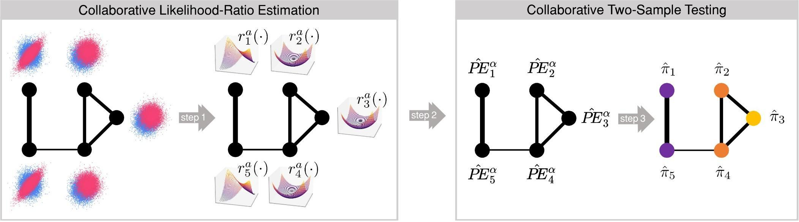

# Collaborative Likelihood-Ratio Estimation over Graphs. 

This repository implements a likelihood-ratio estimation framework called **Collaborative Likelihood-Ratio Estimation** and a derived multiple hypothesis testing method called **Collaborative Two-Sample Testing**.

### Requirements:
- `contextility` 1.6.2  
- `dill` 0.3.9  
- `geopandas` 1.0.1  
- `joblib` 1.4.2  
- `matplotlib` 3.8.4  
- `numba` 0.60.0  
- `numpy` 2.0.2  
- `obspy` 1.4.1  
- `pandas` 2.2.3  
- `pygsp` 0.5.1  
- `scikit-learn` 1.6.1  
- `scipy` 1.13.1  
- `shapely` 2.0.7  
- `statsmodels` 0.14.4  
- `xyzservices` 2025.1.0

### Code Organization

The code consists of the following components:

#### Generic elements
1. **Evaluation**: Contains evaluation metrics used to compare methods.
2. **Experiments**: Code for generating the experiments described in the paper.
3. **Models**: Includes the implementation of GRULSIF, Pool, and a Python version of RULSIF, ULSIF, and KLIEP.
4. **Results**: This folder will contain the outputs of the experiments. The results from running each algorithm and scenario are saved as pickle files.

#### Elements to replicate the experiments of the paper **Collaborative Likelihood-Ratio Estimation over Graphs**
5. **example_GRULSIF.ipynb**: A Jupyter notebook illustrating how to use GRULSIF on a given dataset.
6. **run_experiments_collaborative.py**: Code to replicate the experiments presented in the paper.
7. **plot_results_errors.py**: Once `run_experiments_collaborative.py` has been executed for all methods used in the paper, this script generates plots similar to those presented in the paper.
8. **alpha_comparison.py**: After `run_experiments_collaborative.py` has been executed for the alpha parameters {0.01, 0.1, 0.5}, this script generates plots comparing different values of alpha.

#### Elements to replicate the experiments of the paper **Collaborative non-parametric two-sample testing**
9. **example_GRULSIF.ipynb**: A Jupyter notebook illustrating how to use CTST on a given dataset.


## GRULSIF and Collaborative likelihood-ratio Estimation over Graphs.

Collaborative likelihood-ratio Estimation over Graphs is relevant for applications involving multiple statistical estimation tasks that can be mapped to the nodes of a fixed graph expressing pairwise task similarity. Each graph node $v$  observes i.i.d data from two unknown node-specific p.d.f's, $p_v$ and $q_v$, and the goal is to estimate the likelihood-ratios: 

$r_v(x) = \frac{q_v(x)}{p_v(x)}$ for all $v$.

Our contribution to this problem is multifold: we present a non-parametric collaborative framework that leverages the graph structure of the problem to solve the tasks more efficiently; we present a concrete method that we call **Graph-based Relative Unconstrained Least-Squares Importance Fitting (GRULSIF)** along with an efficient implementation. In a series of experiments, we demonstrate that the joint likelihood-ratio estimation of GRULSIF at all graph nodes is more accurate compared to state-of-the-art methods that operate independently at each node.


<div align="center">
  
</div>

### Goal: 
First we introduce the necessary components to reproduce results similar to those described in the paper 'Collaborative likelihood-ratio estimation over graphs'.

## Remarks
- To see a concrete example of how GRULSIF works, please refer to the Jupyter notebook **example_GRULSIF.ipynb**. 

## How to Generate the Results Reported in the Paper?

### Synthetic Experiments

**Results comparing the different kernel-based likelihood-ratio estimators** 

### Steps:
1. **Set the results directory** where the output will be saved, e.g.:  
   `"C:/Users/.../Results"`

2. Given the **experiment** (`1A, 1B, 2A, 2B, 2C`), the **method** (`grulsif`, `pool`, `rulsif`, `ulsif`, `kliep`),  the **regularization parameter** $\alpha$ (for **grulsif**, **pool**, **rulsif**), and the **threshold coherence** parameter for dictionary construction, estimate the likelihood ratios for all nodes.

   ```bash
   python run_experiments_collaborative_LRE.py  --results_directory "C:/Users/..../Results" --model "grulsif" --experiment "1A" --n_nodes=100 --alpha 0.1 --threshold_coherence 0.3 --N_runs 10

   python run_experiments_collaborative_LRE.py  --results_directory "C:/Users/..../Results" --model "pool" --experiment "1A" --n_nodes=100 --alpha 0.1 --threshold_coherence 0.3 --N_runs 10

   python run_experiments_collaborative_LRE.py  --results_directory "C:/Users/.../Results" --model "rulsif" --experiment "1A" --n_nodes=100 --alpha 0.1 --N_runs 10

   python run_experiments_collaborative_LRE.py  --results_directory "C:/Users/.../Results" --model "ulsif" --experiment "1A" --n_nodes=100 --N_runs 10

   python run_experiments_collaborative_LRE.py  --results_directory "C:/Users/.../Results" --model "kliep" --experiment "1A" --n_nodes=100 --N_runs 10
   
3. **Generate the plots** Once all the previous lines have been executed, generate plots showing the convergence rates with respect to MSE and the approximation to the $f$-divergence being used.
   
   ```bash
   python plot_results_errors.py --results_directory "C:/Users/.../Results" --experiment "1A"

4. **Repeat the same steps** for each experiment ("1A","1B","2A","2B","2C").

**Results comparing GRULSIF and POOL across diferent values of the regularization parameter $\alpha$** 

### Steps:
1. **Set the results directory** where the output will be saved, e.g.:  
   `"C:/Users/.../Results"`

2. Given the **experiment** (`1A, 1B, 2A, 2B, 2C`) and  the **regularization parameter** $\alpha$ and the **threshold coherence** parameter for dictionary construction, estimate the likelihood ratios for all nodes. In the paper we compare the values of $\alpha \in \{0.01,0.1,0.5\}$

   ```bash
   python run_experiments_collaborative_LRE.py  --results_directory "C:/Users/..../Results" --model "grulsif" --experiment "1A" --n_nodes=100 --alpha 0.01 --threshold_coherence 0.3 --N_runs 10

   python run_experiments_collaborative_LRE.py  --results_directory "C:/Users/..../Results" --model "pool" --experiment "1A" --n_nodes=100 --alpha 0.01 --threshold_coherence 0.3 --N_runs 10

   python run_experiments_collaborative_LRE.py  --results_directory "C:/Users/..../Results" --model "grulsif" --experiment "1A" --n_nodes=100 --alpha 0.1 --threshold_coherence 0.3 --N_runs 10

   python run_experiments_collaborative_LRE.py  --results_directory "C:/Users/..../Results" --model "pool" --experiment "1A" --n_nodes=100 --alpha 0.1 --threshold_coherence 0.3 --N_runs 10

   python run_experiments_collaborative_LRE.py  --results_directory "C:/Users/..../Results" --model "grulsif" --experiment "1A" --n_nodes=100 --alpha 0.5 --threshold_coherence 0.3 --N_runs 10

   python run_experiments_collaborative_LRE.py  --results_directory "C:/Users/..../Results" --model "pool" --experiment "1A" --n_nodes=100 --alpha 0.5 --threshold_coherence 0.3 --N_runs 10
 
3. **Generate the plots** Once all the previous lines have been executed, generate plots showing the convergence rates with respect to MSE and the approximation to the $f$-divergence being used.
   
   ```bash
   python alpha_comparison.py  --results_directory "C:/Users/.../Results" --experiment "1A"

4. **Repeat the same steps** for each experiment ("1A","1B","2A","2B","2C").

**Results comparing GRULSIF and POOL across diferent graph sizes (n_nodes)** 

### Steps:
1. **Set the results directory** where the output will be saved, e.g.:  
   `"C:/Users/.../Results"`

2. Given the **experiment** (`1A, 1B, 2A, 2B, 2C`) and  the **regularization parameter** $\alpha$ and the **threshold coherence** parameter for dictionary construction, estimate the likelihood ratios for all nodes. In the paper we compare the values of n_nodes in $\{100,500,1000\}$.

   ```bash
   python run_experiments_collaborative_LRE.py  --results_directory "C:/Users/..../Results" --model "grulsif" --experiment "1A" --n_nodes=100 --alpha 0.1 --threshold_coherence 0.3 --N_runs 10

   python run_experiments_collaborative_LRE.py  --results_directory "C:/Users/..../Results" --model "pool" --experiment "1A" --n_nodes=100 --alpha 0.1 --threshold_coherence 0.3 --N_runs 10

   python run_experiments_collaborative_LRE.py  --results_directory "C:/Users/..../Results" --model "grulsif" --experiment "1A" --n_nodes=500 --alpha 0.1 --threshold_coherence 0.3 --N_runs 10

   python run_experiments_collaborative_LRE.py  --results_directory "C:/Users/..../Results" --model "pool" --experiment "1A" --n_nodes=500 --alpha 0.1 --threshold_coherence 0.3 --N_runs 10

   python run_experiments_collaborative_LRE.py  --results_directory "C:/Users/..../Results" --model "grulsif" --experiment "1A" --n_nodes=1000 --alpha 0.1 --threshold_coherence 0.3 --N_runs 10

   python run_experiments_collaborative_LRE.py  --results_directory "C:/Users/..../Results" --model "pool" --experiment "1A" --n_nodes=1000 --alpha 0.1 --threshold_coherence 0.3 --N_runs 10

 
3. **Generate the plots** Once all the previous lines have been executed, generate plots showing the convergence rates with respect to MSE and the approximation to the $f$-divergence being used.
   
   ```bash
   python N_comparison.py  --results_directory "C:/Users/.../Results" --experiment "1A"

4. **Repeat the same steps** for each experiment ("1A","1B","2A","2B","2C").

### Seimic datasets

In this set of experiments, we aim to approximate the likelihood ratios over real data,  
where it holds approximately that $p_v \approx q_v$ for all nodes.  The datasets are downloaded from [GEONET](https://www.geonet.org.nz/).  To replicate the experiments from the paper, we refer to the events with the following IDs:  
**2021p405872**, **2023p741652**, **2024p817566**.


<div align="center">
  
</div>

### Steps:

1. **Set the data and results directory**  Define the directories where the preprocessed dataset and results will be saved:  
   - `"C:/Users/.../Data"` (for data)  
   - `"C:/Users/.../Results"` (for results)  

2. **Preprocess the waveforms**  Given an event ID (available on [GEONET](https://www.geonet.org.nz/)), run the preprocessing script:  

   ```bash
   python preprocess_seismic.py --data_directory "C:/Users/.../Data" --eventid "2023p741652"  # Example

3. **Compare the performance** The methods GRULSIF, POOL, RULSIF, ULSIF, and KLIEP will be fitted to the preprocessed dataset and compared in terms of MSE. The results will be saved in a CSV file.

   ```bash
   python run_experiments_collaborative_LRE_seismic_dataset.py --data_directory "C:/Users/.../Data" --results_directory "C:/Users/.../Results" --alpha 0.1 
   --event_id "2023p741652" ### Example with event_id="2023p741652" and alpha=0.1

## Collaborative non-parametric two-sample testing. 

We illustrate one of the potential applications of GRULSIF: the development of a hypothesis testing problem with a graph-structured prior. This idea is presented in the paper *Collaborative Non-Parametric Two-Sample Testing*, published in the Proceedings of the 27th International Conference on Art

<div align="center">
  
</div>

Multiple two-sample test problem in a graph-structured setting is a common scenario in fields such as Spatial Statistics and Neuroscience. Each node $v$ in fixed graph deals with a two-sample testing problem between two node-specific probability density functions, $p_v$ and $q_v$. The goal is to identify nodes where the null hypothesis $p_v = q_v$ should be rejected, under the assumption that connected nodes would yield similar test outcomes. We propose the non-parametric **Collaborative Two-Sample Testing** (**CTST**) framework that efficiently leverages the graph structure and minimizes the assumptions over $p_v$ and $q_v$. **CTST** integrates elements from $f$-div estimation, Kernel Methods, and Multitask Learning. We use synthetic experiments and a real sensor network detecting seismic activity to demonstrate that **CTST** outperforms state-of-the-art non-parametric statistical tests that apply at each node independently, hence disregard the geometry of the problem.


### Goal: 
First we introduce the necessary components to reproduce results similar to those described in the paper 'Collaborative non-parametric two-sample testing'.

## Remarks
- To see a concrete example of how CTST works, please refer to the Jupyter notebook **example_C2ST.ipynb**. 

## How to Generate the Results Reported in the Paper?

### Synthetic Experiments

**Results comparing the different kernel-based likelihood-ratio estimators** 

### Steps:
1. **Set the results directory** where the output will be saved, e.g.:  
   `"C:/Users/.../Results"`

2. Given the **experiment** (`1A, 1B, 2A, 2B`), the **method** (`grulsif`, `pool`, `rulsif`, `lstt`, `kliep`,`mmd_median`,`mmd_max`), sample size per node $N$, the **regularization parameter** $\alpha$ (for **grulsif**, **pool**, **rulsif**), and the **threshold coherence** parameter for dictionary construction, compute the multiple hypothesis testing associated to the nodes of a graph: 

   ```bash
   python run_experiments_collaborative_two_sample_test.py --results_directory "C:/Users/..../Results" --model "c2st" --experiment "1A" --N 50  --alpha 0.1 --threshold_coherence 0.3 

   python run_experiments_collaborative_two_sample_test.py --results_directory "C:/Users/..../Results" --model "pool" --experiment "1A" --N 50 --alpha 0.1 --threshold_coherence 0.3 

   python run_experiments_collaborative_two_sample_test.py --results_directory "C:/Users/.../Results" --model "rulsif" --experiment "1A" --N 50 --alpha 0.1 

   python run_experiments_collaborative_two_sample_test.py --results_directory "C:/Users/.../Results" --model "lstt" --experiment "1A" --N 50

   python run_experiments_collaborative_two_sample_test.py --results_directory "C:/Users/.../Results" --model "kliep" --experiment "1A" --N 50 

   python run_experiments_collaborative_two_sample_test.py --results_directory "C:/Users/.../Results" --model "mmd_median" --experiment "1A" --N 50 

   python run_experiments_collaborative_two_sample_test.py --results_directory "C:/Users/.../Results" --model "mmd_max" --experiment "1A" --N 50

3. **AFROC plots** Compute the AFROC curves compared all the methods: 

   ```bash
   python plot_AFROC_synthetic_experiments.py --results_directory ".../Results" --experiment "1A" --N 50

4. Repeat step 2 and 3 for the sample sizes $N=\{50,100,250\}$. 

5. **Repeat the same steps** for each experiment ("1A","1B","2A","2B").

**Results comparing at different values of alpha** 

### Steps:
1. **Set the results directory** where the output will be saved, e.g.:  
   `"C:/Users/.../Results"`

2. Given the **experiment** (`1A, 1B, 2A, 2B`) and  the **regularization parameter** $\alpha$ and the **threshold coherence** parameter for dictionary construction, we compare ctst and pool for different values of $\alpha$. In the paper we compare the values of $\alpha \in \{0.01,0.1,0.5\}$: 

   ```bash
   python run_experiments_collaborative_two_sample_test.py --results_directory "C:/Users/..../Results" --model "c2st" --experiment "1A" --N 50  --alpha 0.01 --threshold_coherence 0.3 

   python run_experiments_collaborative_two_sample_test.py --results_directory "C:/Users/..../Results" --model "pool" --experiment "1A" --N 100 --alpha 0.01 --threshold_coherence 0.3 

   python run_experiments_collaborative_two_sample_test.py --results_directory "C:/Users/..../Results" --model "c2st" --experiment "1A" --N 50  --alpha 0.1 --threshold_coherence 0.3 

   python run_experiments_collaborative_two_sample_test.py --results_directory "C:/Users/..../Results" --model "pool" --experiment "1A" --N 100 --alpha 0.1 --threshold_coherence 0.3 

   python run_experiments_collaborative_two_sample_test.py --results_directory "C:/Users/..../Results" --model "c2st" --experiment "1A" --N 50  --alpha 0.5 --threshold_coherence 0.3 

   python run_experiments_collaborative_two_sample_test.py --results_directory "C:/Users/..../Results" --model "pool" --experiment "1A" --N 100 --alpha 0.5 --threshold_coherence 0.3 


3. **AFROC plots** Compute the AFROC curves compared all the methods: 

   ```bash
   python plot_AFROC_synthetic_experiments.py --results_directory ".../Results" --experiment "1A" --N 50

4. Repeat step 2 and 3 for the sample sizes $N=\{50,100,250\}$. 

5. **Repeat the same steps** for each experiment ("1A","1B","2A","2B").

### Seimic datasets

We use seismic data as a practical example to showcase the potential of CTST in performing spatial statistical analyses. However, we emphasize that this should not be interpreted as an attempt to outperform existing state-of-the-art methods in the field. Geological hazard monitoring systems consist of several stations strategically positioned across a territory to monitor ground noise and shaking through a variety of sensors. When a seismic event occurs, it travels through the Earth, and this is captured by the monitoring sensors. Stations closer to the epicenter of a seismic event tend to show a higher response, exhibiting faster reactions and more pronounced differences in their pre- and post-event data. In this context, a graph-structured multiple two-sample test can be used to assess the significance of a seismic event and identify the stations and time periods during which each station was activated. The datasets are downloaded from GEONET. To replicate the experiments from the paper, we refer to the events with the following IDs: **2021p405872**, **2023p741652**.

<div align="center">
  
</div>

### Steps:

1. **Set the data and results directory**  Define the directories where the preprocessed dataset and results will be saved:  
   - `"C:/Users/.../Data"` (for data)  
   - `"C:/Users/.../Results"` (for results)  

2. **Preprocess the waveforms**  Given an event ID (available on [GEONET](https://www.geonet.org.nz/)), run the preprocessing script:  

   ```bash
   python preprocess_seismic_two_sample_test.py --data_directory "C:/Users/.../Data" --eventid "2023p741652"  # Example with event_id="2023p741652"

3. **Run the different models over the data set** The methods GRULSIF, POOL, RULSIF, ULSIF,KLIEP and MMD will be fitted to the preprocessed dataset. 

   ```bash
   python run_experiments_collaborative_two_sample_test_seismics.py  --data_directory "C:/Users/.../Data" --results_directory "C:/Users/.../Results" --alpha 0.1 
   --event_id "2023p741652" # Example with event_id="2023p741652" and alpha=0.1

4. **Generate the maps and time series showing the results** A final plot with the largest cluster of nodes and time stamps that are statistically significant with respect to a given $p$-value is generated:
   ```bash
   python plot_results_real_experiment.py --data_directory "C:/Users/.../Data" --results_directory "C:/Users/.../Results"  --event_id "2023p741652" --p_values 0.05 # Example with event_id="2023p741652" and alpha=0.1

## References 

If you find this repository useful for your work, please cite the following publications: 

```bibtex
@misc{delaconcha2024collaborativelikelihoodratioestimationgraphs,
      title={Collaborative likelihood-ratio estimation over graphs}, 
      author={Alejandro de la Concha and Nicolas Vayatis and Argyris Kalogeratos},
      year={2024},
      eprint={2205.14461},
      archivePrefix={arXiv},
      primaryClass={stat.ML},
      url={https://arxiv.org/abs/2205.14461}, 
}

@misc{delaconcha2024collaborativenonparametrictwosampletesting,
      title={Collaborative non-parametric two-sample testing}, 
      author={Alejandro de la Concha and Nicolas Vayatis and Argyris Kalogeratos},
      year={2024},
      eprint={2402.05715},
      archivePrefix={arXiv},
      primaryClass={stat.ML},
      url={https://arxiv.org/abs/2402.05715}, 
}